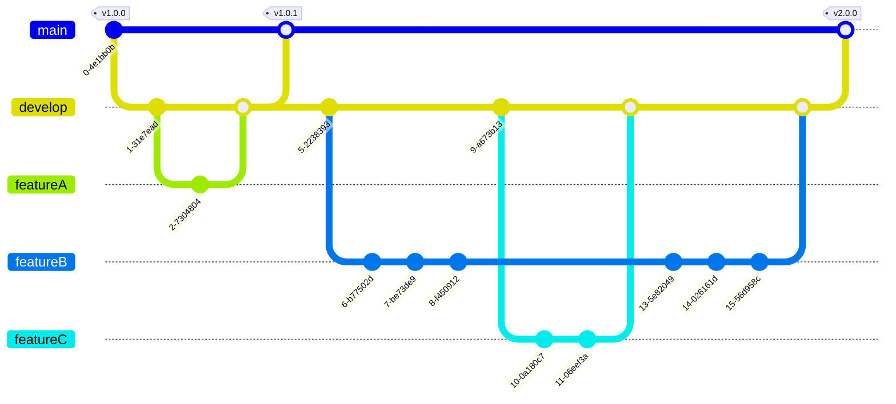

```mermaid
%%{init: { 'theme': 'default' } }%%
gitGraph
    commit tag: "v1.0.0"

        branch develop
        commit
        checkout main

            checkout develop
            branch featureA
            commit
            checkout develop
            merge featureA

        checkout main
        merge develop tag: "v1.0.1"

            checkout develop
            commit
            branch featureB
            commit
            commit
            commit

            checkout develop
            commit
            branch featureC
            commit
            commit
            checkout develop
            merge featureC

            checkout featureB
            commit
            commit
            commit
            checkout develop
            merge featureB

        checkout main
        merge develop  tag: "v2.0.0"
```
