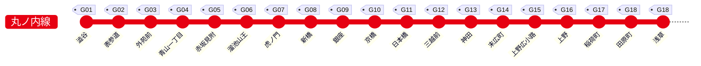

```mermaid
%%{ init: { 'themeVariables': { 'git0': '#e60012' },'gitGraph':{'mainBranchName': '丸ノ内線'} } }%%
gitGraph
    commit id: "澁谷" tag: "G01"
    commit id: "表参道" tag: "G02"
    commit id: "外苑前" tag: "G03"
    commit id: "青山一丁目" tag: "G04"
    commit id: "赤坂見附" tag: "G05"
    commit id: "溜池山王" tag: "G06"
    commit id: "虎ノ門" tag: "G07"
    commit id: "新橋" tag: "G08"
    commit id: "銀座" tag: "G09"
    commit id: "京橋" tag: "G10"
    commit id: "日本橋" tag: "G11"
    commit id: "三越前" tag: "G12"
    commit id: "神田" tag: "G13"
    commit id: "末広町" tag: "G14"
    commit id: "上野広小路" tag: "G15"
    commit id: "上野" tag: "G16"
    commit id: "稲荷町" tag: "G17"
    commit id: "田原町" tag: "G18"
    commit id: "浅草" tag: "G18"
```
