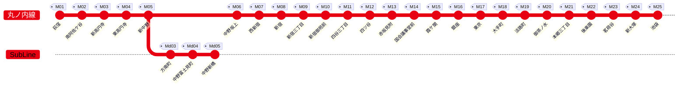

```mermaid
%%{init: {'themeVariables': { 'git0': '#e60012', 'git1': '#e60012' }, 'gitGraph':{'mainBranchName': '丸ノ内線'}} }%%
gitGraph
    commit id: "荻窪" tag: "M01"
    commit id: "南阿佐ケ谷" tag: "M02"
    commit id: "新高円寺" tag: "M03"
    commit id: "東高円寺" tag: "M04"
    commit id: "新中野" tag: "M05"
    branch SubLine
        commit id: "方南町" tag: "Md03"
        commit id: "中野富士見町" tag: "Md04"
        commit id: "中野新橋" tag: "Md05"
    checkout '丸ノ内線'
    commit id: "中野坂上" tag: "M06"
    commit id: "西新宿" tag: "M07"
    commit id: "新宿" tag: "M08"
    commit id: "新宿三丁目" tag: "M09"
    commit id: "新宿御苑前" tag: "M10"
    commit id: "四谷三丁目" tag: "M11"
    commit id: "四ツ谷" tag: "M12"
    commit id: "赤坂見附" tag: "M13"
    commit id: "国会議事堂前" tag: "M14"
    commit id: "霞ケ関" tag: "M15"
    commit id: "銀座" tag: "M16"
    commit id: "東京" tag: "M17"
    commit id: "大手町" tag: "M18"
    commit id: "淡路町" tag: "M19"
    commit id: "御茶ノ水" tag: "M20"
    commit id: "本郷三丁目" tag: "M21"
    commit id: "後楽園" tag: "M22"
    commit id: "茗荷谷" tag: "M23"
    commit id: "新大塚" tag: "M24"
    commit id: "池袋" tag: "M25"
```
