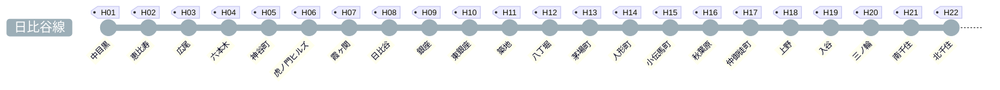

```mermaid
%%{ init: { 'themeVariables': { 'git0': '#9caeb7' },'gitGraph':{'mainBranchName': '日比谷線'} } }%%
gitGraph
    commit id: "中目黒" tag: "H01"
    commit id: "恵比寿" tag: "H02"
    commit id: "広尾" tag: "H03"
    commit id: "六本木" tag: "H04"
    commit id: "神谷町" tag: "H05"
    commit id: "虎ノ門ヒルズ" tag: "H06"
    commit id: "霞ヶ関" tag: "H07"
    commit id: "日比谷" tag: "H08"
    commit id: "銀座" tag: "H09"
    commit id: "東銀座" tag: "H10"
    commit id: "築地" tag: "H11"
    commit id: "八丁堀" tag: "H12"
    commit id: "茅場町" tag: "H13"
    commit id: "人形町" tag: "H14"
    commit id: "小伝馬町" tag: "H15"
    commit id: "秋葉原" tag: "H16"
    commit id: "仲御徒町" tag: "H17"
    commit id: "上野" tag: "H18"
    commit id: "入谷" tag: "H19"
    commit id: "三ノ輪" tag: "H20"
    commit id: "南千住" tag: "H21"
    commit id: "北千住" tag: "H22"
```
