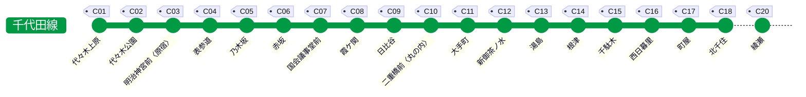

```mermaid
%%{ init: { 'themeVariables': { 'git0': '#009944' },'gitGraph':{'mainBranchName': '千代田線'} } }%%
gitGraph
    commit id: "代々木上原" tag: "C01"
    commit id: "代々木公園" tag: "C02"
    commit id: "明治神宮前〈原宿〉" tag: "C03"
    commit id: "表参道" tag: "C04"
    commit id: "乃木坂" tag: "C05"
    commit id: "赤坂" tag: "C06"
    commit id: "国会議事堂前" tag: "C07"
    commit id: "霞ケ関" tag: "C08"
    commit id: "日比谷" tag: "C09"
    commit id: "二重橋前〈丸の内〉" tag: "C10"
    commit id: "大手町" tag: "C11"
    commit id: "新御茶ノ水" tag: "C12"
    commit id: "湯島" tag: "C13"
    commit id: "根津" tag: "C14"
    commit id: "千駄木" tag: "C15"
    commit id: "西日暮里" tag: "C16"
    commit id: "町屋" tag: "C17"
    commit id: "北千住" tag: "C18"
    commit id: "綾瀬" tag: "C19"
    commit id: "綾瀬" tag: "C20"
```
