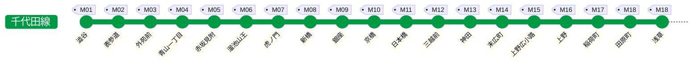

```mermaid
%%{ init: { 'themeVariables': { 'git0': '#009944' },'gitGraph':{'mainBranchName': '千代田線'} } }%%
gitGraph
    commit id: "澁谷" tag: "M01"
    commit id: "表参道" tag: "M02"
    commit id: "外苑前" tag: "M03"
    commit id: "青山一丁目" tag: "M04"
    commit id: "赤坂見附" tag: "M05"
    commit id: "溜池山王" tag: "M06"
    commit id: "虎ノ門" tag: "M07"
    commit id: "新橋" tag: "M08"
    commit id: "銀座" tag: "M09"
    commit id: "京橋" tag: "M10"
    commit id: "日本橋" tag: "M11"
    commit id: "三越前" tag: "M12"
    commit id: "神田" tag: "M13"
    commit id: "末広町" tag: "M14"
    commit id: "上野広小路" tag: "M15"
    commit id: "上野" tag: "M16"
    commit id: "稲荷町" tag: "M17"
    commit id: "田原町" tag: "M18"
    commit id: "浅草" tag: "M18"
```
