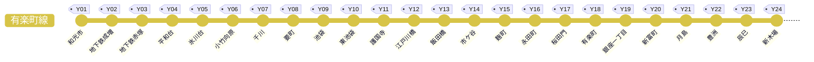

```mermaid
%%{ init: { 'themeVariables': { 'git0': '#d7c447' },'gitGraph':{'mainBranchName': '有楽町線'} } }%%
gitGraph
    commit id: "和光市" tag: "Y01"
    commit id: "地下鉄成増" tag: "Y02"
    commit id: "地下鉄赤塚" tag: "Y03"
    commit id: "平和台" tag: "Y04"
    commit id: "氷川台" tag: "Y05"
    commit id: "小竹向原" tag: "Y06"
    commit id: "千川" tag: "Y07"
    commit id: "要町" tag: "Y08"
    commit id: "池袋" tag: "Y09"
    commit id: "東池袋" tag: "Y10"
    commit id: "護国寺" tag: "Y11"
    commit id: "江戸川橋" tag: "Y12"
    commit id: "飯田橋" tag: "Y13"
    commit id: "市ケ谷" tag: "Y14"
    commit id: "麹町" tag: "Y15"
    commit id: "永田町" tag: "Y16"
    commit id: "桜田門" tag: "Y17"
    commit id: "有楽町" tag: "Y18"
    commit id: "銀座一丁目" tag: "Y19"
    commit id: "新富町" tag: "Y20"
    commit id: "月島" tag: "Y21"
    commit id: "豊洲" tag: "Y22"
    commit id: "辰巳" tag: "Y23"
    commit id: "新木場" tag: "Y24"
```
