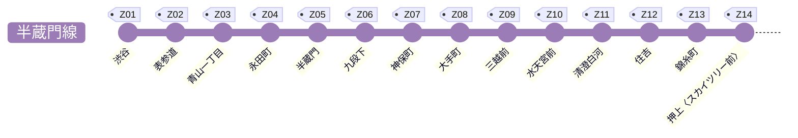

```mermaid
%%{ init: { 'themeVariables': { 'git0': '#9b7cb6' },'gitGraph':{'mainBranchName': '半蔵門線'} } }%%
gitGraph
    commit id: "渋谷" tag: "Z01"
    commit id: "表参道" tag: "Z02"
    commit id: "青山一丁目" tag: "Z03"
    commit id: "永田町" tag: "Z04"
    commit id: "半蔵門" tag: "Z05"
    commit id: "九段下" tag: "Z06"
    commit id: "神保町" tag: "Z07"
    commit id: "大手町" tag: "Z08"
    commit id: "三越前" tag: "Z09"
    commit id: "水天宮前" tag: "Z10"
    commit id: "清澄白河" tag: "Z11"
    commit id: "住吉" tag: "Z12"
    commit id: "錦糸町" tag: "Z13"
    commit id: "押上〈スカイツリー前〉" tag: "Z14"
```
