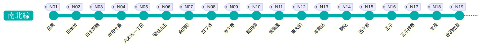

```mermaid
%%{ init: { 'themeVariables': { 'git0': '#00ada9' },'gitGraph':{'mainBranchName': '南北線'} } }%%
gitGraph
    commit id: "目黒" tag: "N01"
    commit id: "白金台" tag: "N02"
    commit id: "白金高輪" tag: "N03"
    commit id: "麻布十番" tag: "N04"
    commit id: "六本木一丁目" tag: "N05"
    commit id: "溜池山王" tag: "N06"
    commit id: "永田町" tag: "N07"
    commit id: "四ツ谷" tag: "N08"
    commit id: "市ケ谷" tag: "N09"
    commit id: "飯田橋" tag: "N10"
    commit id: "後楽園" tag: "N11"
    commit id: "東大前" tag: "N12"
    commit id: "本駒込" tag: "N13"
    commit id: "駒込" tag: "N14"
    commit id: "西ケ原" tag: "N15"
    commit id: "王子" tag: "N16"
    commit id: "王子神谷" tag: "N17"
    commit id: "志茂" tag: "N18"
    commit id: "赤羽岩淵" tag: "N19"
```
