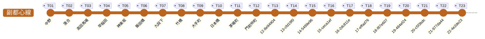

```mermaid
%%{ init: { 'themeVariables': { 'git0': '#bb641d' },'gitGraph':{'mainBranchName': '副都心線'} } }%%
gitGraph
    commit id: "中野" tag: "T01"
    commit id: "落合" tag: "T02"
    commit id: "高田馬場" tag: "T03"
    commit id: "早稲田" tag: "T04"
    commit id: "神楽坂" tag: "T05"
    commit id: "飯田橋" tag: "T06"
    commit id: "九段下" tag: "T07"
    commit id: "竹橋" tag: "T08"
    commit id: "大手町" tag: "T09"
    commit id: "日本橋" tag: "T10"
    commit id: "茅場町" tag: "T11"
    commit id: "門前仲町" tag: "T12"
    commit id: "" tag: "T13"
    commit id: "" tag: "T14"
    commit id: "" tag: "T15"
    commit id: "" tag: "T16"
    commit id: "" tag: "T17"
    commit id: "" tag: "T18"
    commit id: "" tag: "T19"
    commit id: "" tag: "T20"
    commit id: "" tag: "T21"
    commit id: "" tag: "T22"
    commit id: "" tag: "T23"
```
