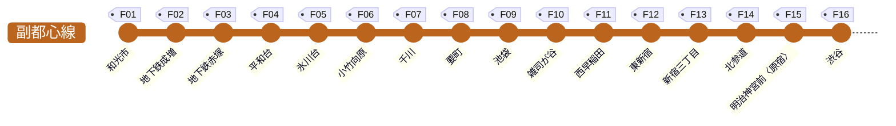

```mermaid
%%{ init: { 'themeVariables': { 'git0': '#bb641d' },'gitGraph':{'mainBranchName': '副都心線'} } }%%
gitGraph
    commit id: "和光市" tag: "F01"
    commit id: "地下鉄成増" tag: "F02"
    commit id: "地下鉄赤塚" tag: "F03"
    commit id: "平和台" tag: "F04"
    commit id: "氷川台" tag: "F05"
    commit id: "小竹向原" tag: "F06"
    commit id: "千川" tag: "F07"
    commit id: "要町" tag: "F08"
    commit id: "池袋" tag: "F09"
    commit id: "雑司が谷" tag: "F10"
    commit id: "西早稲田" tag: "F11"
    commit id: "東新宿" tag: "F12"
    commit id: "新宿三丁目" tag: "F13"
    commit id: "北参道" tag: "F14"
    commit id: "明治神宮前〈原宿〉" tag: "F15"
    commit id: "渋谷" tag: "F16"
```
